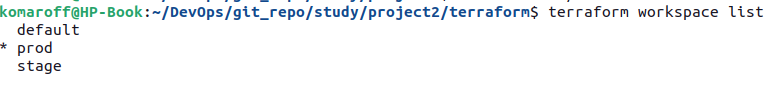

## Домашнее задание к занятию "7.3. Основы и принцип работы Терраформ"

#### Задача 2

  

Вывод Terraform Plan:

```
komaroff@HP-Book:~/DevOps/git_repo/study/project2/terraform$ terraform plan

Terraform used the selected providers to generate the following execution plan. Resource actions are indicated with the following symbols:
  + create

Terraform will perform the following actions:

  # module.instance.yandex_compute_instance.fe_vm["fe-db"] will be created
  + resource "yandex_compute_instance" "fe_vm" {
      + created_at                = (known after apply)
      + folder_id                 = (known after apply)
      + fqdn                      = (known after apply)
      + hostname                  = (known after apply)
      + id                        = (known after apply)
      + metadata                  = {
          + "ssh-keys" = <<-EOT
                ubuntu:ssh-rsa AAAAB3NzaC1yc2EAAAADAQABAAABAQCgmbUnCso/GQ4jigRR2UvFHCWa4ZTG3zpO5z052Pxl0cj1sbv2nSWFJA8IR4CEjtr+c4CkdSyxR8pLtH30vg4TaAAjWPkIsXBrq4tQZleDfdWOKbFR8T8rKEAlHJBeWvcy06SP51k/cJ7AVg3liZrIJk1F8D8pDzoXQXWA8KoIYTbQQeWfeNoo3RO3sDWnZBhlGwucZjBjfnu18ZRkZzHIIi7DM3pF9EO7qW1zlU2+mNIYGDE+Y4+3jRU3duq7jyxe1ecfoae9iDmrtm/H5JdHk1kVqRe+Jq02BtBkzg8P8CEHHVvrlQaZsCh/eb4u2N+LS/3z1jGA2eZRYwL3+r09 komaroff@HP-Book
            EOT
        }
      + name                      = "vm-prod-fe-db"
      + network_acceleration_type = "standard"
      + platform_id               = "standard-v2"
      + service_account_id        = (known after apply)
      + status                    = (known after apply)
      + zone                      = (known after apply)

      + boot_disk {
          + auto_delete = true
          + device_name = (known after apply)
          + disk_id     = (known after apply)
          + mode        = (known after apply)

          + initialize_params {
              + block_size  = (known after apply)
              + description = (known after apply)
              + image_id    = "fd8f5l3798bmqndsmvem"
              + name        = (known after apply)
              + size        = (known after apply)
              + snapshot_id = (known after apply)
              + type        = "network-hdd"
            }
        }

      + network_interface {
          + index              = (known after apply)
          + ip_address         = (known after apply)
          + ipv4               = true
          + ipv6               = (known after apply)
          + ipv6_address       = (known after apply)
          + mac_address        = (known after apply)
          + nat                = true
          + nat_ip_address     = (known after apply)
          + nat_ip_version     = (known after apply)
          + security_group_ids = (known after apply)
          + subnet_id          = (known after apply)
        }

      + placement_policy {
          + host_affinity_rules = (known after apply)
          + placement_group_id  = (known after apply)
        }

      + resources {
          + core_fraction = 100
          + cores         = 8
          + memory        = 8
        }

      + scheduling_policy {
          + preemptible = (known after apply)
        }
    }

  # module.instance.yandex_compute_instance.fe_vm["fe-web"] will be created
  + resource "yandex_compute_instance" "fe_vm" {
      + created_at                = (known after apply)
      + folder_id                 = (known after apply)
      + fqdn                      = (known after apply)
      + hostname                  = (known after apply)
      + id                        = (known after apply)
      + metadata                  = {
          + "ssh-keys" = <<-EOT
                ubuntu:ssh-rsa AAAAB3NzaC1yc2EAAAADAQABAAABAQCgmbUnCso/GQ4jigRR2UvFHCWa4ZTG3zpO5z052Pxl0cj1sbv2nSWFJA8IR4CEjtr+c4CkdSyxR8pLtH30vg4TaAAjWPkIsXBrq4tQZleDfdWOKbFR8T8rKEAlHJBeWvcy06SP51k/cJ7AVg3liZrIJk1F8D8pDzoXQXWA8KoIYTbQQeWfeNoo3RO3sDWnZBhlGwucZjBjfnu18ZRkZzHIIi7DM3pF9EO7qW1zlU2+mNIYGDE+Y4+3jRU3duq7jyxe1ecfoae9iDmrtm/H5JdHk1kVqRe+Jq02BtBkzg8P8CEHHVvrlQaZsCh/eb4u2N+LS/3z1jGA2eZRYwL3+r09 komaroff@HP-Book
            EOT
        }
      + name                      = "vm-prod-fe-web"
      + network_acceleration_type = "standard"
      + platform_id               = "standard-v2"
      + service_account_id        = (known after apply)
      + status                    = (known after apply)
      + zone                      = (known after apply)

      + boot_disk {
          + auto_delete = true
          + device_name = (known after apply)
          + disk_id     = (known after apply)
          + mode        = (known after apply)

          + initialize_params {
              + block_size  = (known after apply)
              + description = (known after apply)
              + image_id    = "fd8f5l3798bmqndsmvem"
              + name        = (known after apply)
              + size        = (known after apply)
              + snapshot_id = (known after apply)
              + type        = "network-hdd"
            }
        }

      + network_interface {
          + index              = (known after apply)
          + ip_address         = (known after apply)
          + ipv4               = true
          + ipv6               = (known after apply)
          + ipv6_address       = (known after apply)
          + mac_address        = (known after apply)
          + nat                = true
          + nat_ip_address     = (known after apply)
          + nat_ip_version     = (known after apply)
          + security_group_ids = (known after apply)
          + subnet_id          = (known after apply)
        }

      + placement_policy {
          + host_affinity_rules = (known after apply)
          + placement_group_id  = (known after apply)
        }

      + resources {
          + core_fraction = 100
          + cores         = 4
          + memory        = 4
        }

      + scheduling_policy {
          + preemptible = (known after apply)
        }
    }

  # module.instance.yandex_compute_instance.vm[0] will be created
  + resource "yandex_compute_instance" "vm" {
      + created_at                = (known after apply)
      + folder_id                 = (known after apply)
      + fqdn                      = (known after apply)
      + hostname                  = (known after apply)
      + id                        = (known after apply)
      + metadata                  = {
          + "ssh-keys" = <<-EOT
                ubuntu:ssh-rsa AAAAB3NzaC1yc2EAAAADAQABAAABAQCgmbUnCso/GQ4jigRR2UvFHCWa4ZTG3zpO5z052Pxl0cj1sbv2nSWFJA8IR4CEjtr+c4CkdSyxR8pLtH30vg4TaAAjWPkIsXBrq4tQZleDfdWOKbFR8T8rKEAlHJBeWvcy06SP51k/cJ7AVg3liZrIJk1F8D8pDzoXQXWA8KoIYTbQQeWfeNoo3RO3sDWnZBhlGwucZjBjfnu18ZRkZzHIIi7DM3pF9EO7qW1zlU2+mNIYGDE+Y4+3jRU3duq7jyxe1ecfoae9iDmrtm/H5JdHk1kVqRe+Jq02BtBkzg8P8CEHHVvrlQaZsCh/eb4u2N+LS/3z1jGA2eZRYwL3+r09 komaroff@HP-Book
            EOT
        }
      + name                      = "vm-prod-1"
      + network_acceleration_type = "standard"
      + platform_id               = "standard-v2"
      + service_account_id        = (known after apply)
      + status                    = (known after apply)
      + zone                      = (known after apply)

      + boot_disk {
          + auto_delete = true
          + device_name = (known after apply)
          + disk_id     = (known after apply)
          + mode        = (known after apply)

          + initialize_params {
              + block_size  = (known after apply)
              + description = (known after apply)
              + image_id    = "fd8f5l3798bmqndsmvem"
              + name        = (known after apply)
              + size        = (known after apply)
              + snapshot_id = (known after apply)
              + type        = "network-hdd"
            }
        }

      + network_interface {
          + index              = (known after apply)
          + ip_address         = (known after apply)
          + ipv4               = true
          + ipv6               = (known after apply)
          + ipv6_address       = (known after apply)
          + mac_address        = (known after apply)
          + nat                = true
          + nat_ip_address     = (known after apply)
          + nat_ip_version     = (known after apply)
          + security_group_ids = (known after apply)
          + subnet_id          = (known after apply)
        }

      + placement_policy {
          + host_affinity_rules = (known after apply)
          + placement_group_id  = (known after apply)
        }

      + resources {
          + core_fraction = 100
          + cores         = 4
          + memory        = 4
        }

      + scheduling_policy {
          + preemptible = (known after apply)
        }
    }

  # module.instance.yandex_compute_instance.vm[1] will be created
  + resource "yandex_compute_instance" "vm" {
      + created_at                = (known after apply)
      + folder_id                 = (known after apply)
      + fqdn                      = (known after apply)
      + hostname                  = (known after apply)
      + id                        = (known after apply)
      + metadata                  = {
          + "ssh-keys" = <<-EOT
                ubuntu:ssh-rsa AAAAB3NzaC1yc2EAAAADAQABAAABAQCgmbUnCso/GQ4jigRR2UvFHCWa4ZTG3zpO5z052Pxl0cj1sbv2nSWFJA8IR4CEjtr+c4CkdSyxR8pLtH30vg4TaAAjWPkIsXBrq4tQZleDfdWOKbFR8T8rKEAlHJBeWvcy06SP51k/cJ7AVg3liZrIJk1F8D8pDzoXQXWA8KoIYTbQQeWfeNoo3RO3sDWnZBhlGwucZjBjfnu18ZRkZzHIIi7DM3pF9EO7qW1zlU2+mNIYGDE+Y4+3jRU3duq7jyxe1ecfoae9iDmrtm/H5JdHk1kVqRe+Jq02BtBkzg8P8CEHHVvrlQaZsCh/eb4u2N+LS/3z1jGA2eZRYwL3+r09 komaroff@HP-Book
            EOT
        }
      + name                      = "vm-prod-2"
      + network_acceleration_type = "standard"
      + platform_id               = "standard-v2"
      + service_account_id        = (known after apply)
      + status                    = (known after apply)
      + zone                      = (known after apply)

      + boot_disk {
          + auto_delete = true
          + device_name = (known after apply)
          + disk_id     = (known after apply)
          + mode        = (known after apply)

          + initialize_params {
              + block_size  = (known after apply)
              + description = (known after apply)
              + image_id    = "fd8f5l3798bmqndsmvem"
              + name        = (known after apply)
              + size        = (known after apply)
              + snapshot_id = (known after apply)
              + type        = "network-hdd"
            }
        }

      + network_interface {
          + index              = (known after apply)
          + ip_address         = (known after apply)
          + ipv4               = true
          + ipv6               = (known after apply)
          + ipv6_address       = (known after apply)
          + mac_address        = (known after apply)
          + nat                = true
          + nat_ip_address     = (known after apply)
          + nat_ip_version     = (known after apply)
          + security_group_ids = (known after apply)
          + subnet_id          = (known after apply)
        }

      + placement_policy {
          + host_affinity_rules = (known after apply)
          + placement_group_id  = (known after apply)
        }

      + resources {
          + core_fraction = 100
          + cores         = 4
          + memory        = 4
        }

      + scheduling_policy {
          + preemptible = (known after apply)
        }
    }

  # module.vpc.yandex_vpc_network.network will be created
  + resource "yandex_vpc_network" "network" {
      + created_at                = (known after apply)
      + default_security_group_id = (known after apply)
      + folder_id                 = (known after apply)
      + id                        = (known after apply)
      + labels                    = (known after apply)
      + name                      = "prod"
      + subnet_ids                = (known after apply)
    }

  # module.vpc.yandex_vpc_subnet.subnet will be created
  + resource "yandex_vpc_subnet" "subnet" {
      + created_at     = (known after apply)
      + folder_id      = (known after apply)
      + id             = (known after apply)
      + labels         = (known after apply)
      + name           = "subnet-prod"
      + network_id     = (known after apply)
      + v4_cidr_blocks = [
          + "192.168.21.0/24",
        ]
      + v6_cidr_blocks = (known after apply)
      + zone           = "ru-central1-a"
    }

Plan: 6 to add, 0 to change, 0 to destroy.

```

Ссылка на репо с конфигом: https://github.com/komaroff-ski/dev_ops_netology/tree/main/homeworks/virt/terraform-3/terraform
